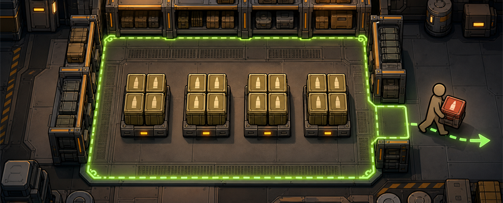

# Storage Group Quotas / 存储组配额

<p align="center">
  
</p>

[English](#english) | [简体中文](#简体中文)

<a id="english"></a>

## English

Set a clear per-item limit for an entire linked storage group. For ammo depots, you can also keep several real stacks so different pawns have separate pickup targets instead of waiting on one reserved pile.

The quota window follows RimWorld's category tree. Set values on a broad category, refine them on a child category, and override only exceptional items. In Similar stacks mode, the per-stack limit and maximum stack count inherit independently.

RimWorld 1.6 · Requires Harmony · Package ID: `steelshadow.storagegroupquotas`

### Which mode should I use?

| What you want | Mode | Result |
| --- | --- | --- |
| Keep an exact total of medicine, meals, shells, ammo, or another item | **Entire storage count** | Each item type may occupy no more than X units across the whole linked storage group. |
| Keep several physical stacks that pawns can reserve separately | **Similar stacks ×N** | Each stack holds at most X units, with at most N stacks. X and N can be inherited or overridden independently; total capacity is X × N. |

Quotas are calculated separately for every item type. Setting a quota of 100 does **not** mean 100 mixed items across the warehouse; it means up to 100 of each item that uses that value.

New quota data uses `N = 1` as its global default maximum stack count. Existing storage settings keep their previously saved global N, and items without a new N override continue to inherit it.

#### Why keep several stacks?

With some hauling or reservation optimization setups, one physical stack may be reserved by only one pawn or job at a time. Multiple physical stacks provide separate reservation targets and can reduce queues when several weapons reload or are resupplied together.

### Quick start

1. Select a shelf or stockpile.
2. Click **Quotas**.
3. Choose **Entire storage count** or **Similar stacks ×N**.
4. Expand the category tree and set values for categories or individual items. Select an inherited cell to create an override; use the adjacent reset control to resume inheritance. In Similar stacks mode, **Per-stack quota** and **Max stacks** are edited independently. The global defaults at the top are optional fallbacks.

The window shows the current quantity and physical stack count for every listed item, plus any overflow or stack layout waiting for hauling work. Its item tree refreshes while open, and its category folding is shared with the vanilla Storage tree. Items that vanilla no longer allows remain visible in gray when they still have a quota or max-stack override, or are physically present in the group.

### How category inheritance works

Each editable field is resolved separately in this order:

1. The item's own override for that field.
2. The nearest category override for that field in its parent chain.
3. That field's global default at the top of the window.

In Similar stacks mode, X and N have independent inheritance chains and may come from different levels. A child can override only **Max stacks** while continuing to inherit its **Per-stack quota**, or the other way around.

A category's values are applied **separately to every descendant item**. For example, setting `Foods` to 100 allows up to 100 of each food definition that inherits it; it is not a shared 100-item budget. Likewise, a category N gives each descendant item its own N-stack allowance rather than one shared stack pool. A quota can explicitly use `0`; max stacks is always at least `1`.

Some RimWorld definitions belong to more than one category. To keep inheritance unambiguous and prevent duplicate rows, the mod uses RimWorld's `FirstThingCategory` as that item's displayed parent and inheritance chain.

### Example: a 105 mm ammunition depot

Set the ammunition category to **25 per stack** and **Max stacks 4**:

- Total capacity is 100 rounds.
- A child category can override only **Max stacks** to 2 and still inherit 25 per stack, giving each item in that child a capacity of 50.
- One stack of 100 is not treated as 75 excess. Haulers progressively split it into up to four stacks of no more than 25.
- If the group contains 125 rounds, exactly 25 are moved outside the group; the retained 100 are then arranged into separate stacks when valid cells are available.

### What happens in game?

- All linked shelves in the same vanilla `StorageGroup` share one quota.
- Each item definition is counted independently.
- New hauling jobs are capped by the group's remaining capacity.
- Existing excess is moved by hauling work; it is never deleted or teleported. With Hauler's Dream or Pick Up And Haul active, total-count overflow can be collected from several nearby stacks in the same source group into pawn inventory. Pickup and unloading both recheck the live quota, and the vanilla single-stack job remains the fallback.
- Haulers first look for valid storage outside the source group. If none exists, they look for a reachable non-storage floor cell outside the group.
- Similar-stacks mode first tries to split or consolidate stacks inside the group. If the selected layout cannot be completed inside the group, the unresolved part may be moved outside.
- The mod does not change `ThingDef.stackLimit` globally.

Because cleanup uses normal work, it needs an available hauler, a valid reservation, a path, and enough usable cells. Changes are therefore not necessarily immediate.

### What does 0 mean?

- **Entire storage count:** `0` means unlimited.
- **Similar stacks ×N:** a per-stack value of `0` uses the item's current stack limit. **Max stacks** is never zero; remove its override to inherit, and its minimum configured value is `1`.

A configured per-stack value never raises a stack above its current `ThingDef.stackLimit`.

### Compatibility

- RimWorld 1.6
- **Harmony is required.**
- Combat Extended is not required, but CE ammunition works because quotas apply to ordinary storable item definitions.
- Hauler's Dream and Pick Up And Haul optionally enable quota-aware batch removal of total-count overflow. Neither becomes a hard dependency: unsupported pawns, occupied hauling inventories, missing APIs, and layout-only work safely use the vanilla hauling path.
- The Hauler's Dream path keeps HD's eligibility settings, smart-overload ceiling, and Combat Extended weight/bulk calculation. Its consolidated unload is clamped both when a destination is chosen and again on arrival, so normal HD cargo also cannot overfill quota-managed storage.
- The Pick Up And Haul path continues to query CE's current weight and bulk capacity before every pickup. CE remains optional and is accessed without a compile-time assembly dependency.
- If Hauler's Dream and Pick Up And Haul are both active, SGQ registers cargo only with Hauler's Dream. HD is designed to replace PUAH, so disabling PUAH is recommended for that load order.
- **Stack Gap (`Andromeda.StackGap`) is incompatible.** Disable it before enabling this mod. Its settings are not migrated.

### Installation outside Steam Workshop

1. Download `StorageGroupQuotas.zip` from the repository's rolling `continuous` prerelease and extract it into RimWorld's `Mods` directory, or build the project from source.
2. Make sure Harmony loads before this mod.
3. Enable **Storage Group Quotas** and keep Stack Gap disabled.

Steam Workshop users only need to subscribe and enable the mod and its required Harmony dependency.

### Player FAQ

**Does each shelf get its own quota?**

No. Linked shelves share the quota of their vanilla storage group. An unlinked shelf or stockpile uses its own local slot group.

**Does Similar stacks ×N always create exactly N stacks?**

No. N is a per-item maximum, not a target. It can be inherited or overridden independently from X; the actual number depends on stored quantity, valid cells, compatible stacks, and available haulers.

**Are quality, material, or hit-point variants separate quotas?**

No. The quota and max-stack budgets are per `ThingDef`. Variants that cannot stack with one another can still share those same budgets.

**Can the group briefly exceed its quota?**

Yes. Capacity is based on currently spawned contents; several already-created jobs, a custom hauling mod that bypasses the patched methods, or directly spawned items may temporarily overshoot. Normal cleanup work handles the result.

**Where is the GitHub project?**

[Source code and issue tracker](https://github.com/Steel-Shadow/RimWorld-StorageGroupQuotas)

### Developer guide

#### Project layout

| Path | Responsibility |
| --- | --- |
| `Source/StorageQuotaData.cs` | Saved mode, independent global defaults, category overrides, and per-`ThingDef` overrides for quota X and maximum stacks N. |
| `Source/QuotaTreeModel.cs` | Pruned vanilla-style category tree, shared mask-8 expansion state, and hierarchical search results. |
| `Source/QuotaDataStore.cs` | Runtime attachment of quota data to vanilla `StorageSettings`. |
| `Source/QuotaUtility.cs` | Scope resolution, counting, effective capacities, overflow discovery, and scan caching. |
| `Source/HarmonyPatches.cs` | Vanilla storage/UI patches, optional Pick Up And Haul integration, and the Combat Extended inventory adapter. |
| `Source/InventoryHaulingCompatibility.cs` | Single-backend selection plus optional Hauler's Dream batching, tracking, unload guards, and quota-cell reservation restoration. |
| `Source/WorkGiver_MoveQuotaOverflow.cs` | Ordinary hauling jobs for exact overflow removal and similar-stack rebalancing. |
| `Source/JobDriver_HaulQuotaOverflowBatch.cs` | Optional inventory batch pickup and quota-checked unloading for total-count overflow. |
| `Source/Window_StorageQuotas.cs` | Quota configuration window in the vanilla Storage tab. |
| `Source/packages.lock.json` | Locked compile-time reference packages for reproducible builds. |
| `About/About.xml` | Package identity, supported game version, dependencies, load-order rules, and incompatibilities. |
| `About/PublishedFileId.txt` | Permanent Steam Workshop identity used for updates and mod-manager metadata. |
| `Defs/WorkGiverDefs/WorkGivers.xml` | Registration of the custom hauling `WorkGiverDef`. |
| `Defs/JobDefs/Jobs.xml` | Registration of the optional quota-overflow inventory batch job. |
| `Languages/` | English and Simplified Chinese keyed translations. |
| `WorkshopDescription.bbcode` | Canonical player-facing Steam Workshop description. |
| `.github/workflows/build-release.yml` | Locked CI build, installable archive, and rolling prerelease publication. |

The mod has no `GameComponent`, `MapComponent`, or global `ModSettings`. Outside the optional batch path, overflow and all stack-layout work use vanilla `JobDefOf.HaulToCell`. One custom `JobDriver` is used only when a supported inventory-hauling backend owns the batch; quota data still lives with the relevant vanilla `StorageSettings`.

#### Dependencies and automatic sorting

`About/About.xml` is the canonical load-order source for RimWorld and tools such as RimSort:

| Relationship | Metadata | Meaning |
| --- | --- | --- |
| Harmony | `modDependencies` and `loadAfter` | Hard dependency and explicit sort edge. Both are kept because mod managers may be configured not to infer load order from dependency declarations. |
| Hauler's Dream | `loadAfter` only | Optional integration: sort after `giwaffed.HaulersDream` so SGQ's final quota guards wrap HD's haul-to-stack and inventory-unload behavior. |
| Pick Up And Haul | `loadAfter` only | Optional integration: sort after it when installed, without making it required. |
| Stack Gap | `incompatibleWith` | Report a conflict instead of trying to solve incompatible storage-capacity patches through ordering. |
| Combat Extended | No dependency or ordering rule | CE ammunition works as ordinary storable items. If CE is present, the optional batch path discovers `CompInventory` by reflection and honors its weight/bulk result; there is still no compile-time CE assembly dependency or patch-order edge. |

`About/PublishedFileId.txt` binds every packaged copy to Workshop item `3775097866`. Community database rules are not required for these author-supplied relationships; they are a separate source used by mod managers to supplement third-party metadata.

#### Scope resolution and persistence

`QuotaUtility.ScopeAt`, `ScopeForSettings`, and `ScopeForThing` resolve a local `SlotGroup` to `SlotGroup.StorageGroup` when one exists; otherwise they use the local slot group. This is the code path that makes linked shelves share a quota.

At runtime, `QuotaDataStore` uses a `ConditionalWeakTable<StorageSettings, Holder>`. `Patch_StorageSettings_ExposeData` deep-scribes the attached `StorageQuotaData` under the `storageGroupQuotas` node. Quota X uses `upperByDefName` and `upperByCategoryDefName`; maximum stacks N uses the optional `maxStacksByDefName` and `maxStacksByCategoryDefName` dictionaries. Missing N dictionaries load as empty, so older saves need no schema migration. `HasPersistentSettings` preserves dormant N settings while TotalCount mode is selected, whereas `Active` limits overflow scanning to settings that currently enforce a quota. `Patch_StorageSettings_CopyFrom` deep-clones all four override dictionaries.

New `StorageQuotaData` instances initialize the global default N (`similarStackCount`, exposed as `DefaultMaxStacks`) to 1. The Scribe fallback intentionally remains 2 because old versions omitted the field whenever it equaled the former default; this preserves existing storage behavior, while new value-1 data is written explicitly and reloads as 1. Old global N values remain the fallback for items without a category or item N override.

#### Capacity formulas

Let `u` be the first quota value found by `item X override → nearest category X override → global X default`; let `n` be found independently by `item N override → nearest category N override → global N default`; and let `L = max(1, ThingDef.stackLimit)`.

```text
TotalCount:
  u = 0  -> total limit = unlimited
  u > 0  -> total limit = u

SimilarStacks:
  per-stack limit = min(L, u = 0 ? L : u)
  max stacks      = max(1, n)
  total limit     = per-stack limit × max stacks
```

The multiplication uses `long` and saturates at `int.MaxValue`. The UI accepts quota values from 0 to 1,000,000,000 and N from 1 to 1,000.

Both quantity and max-stack budgets are per exact `ThingDef`, not per category-wide pool or `CanStackWith` equivalence class. Actual merges still require `Thing.CanStackWith()`.

`ThingDef.FirstThingCategory` defines the item's single canonical tree parent. Both inheritance lookups then walk `ThingCategoryDef.parent` upward, capped at 128 levels as a guard against malformed modded category cycles. Dictionary membership, rather than a nonzero test, distinguishes an explicit quota `0` override from an unset value; N overrides are clamped to at least 1.

#### Harmony patch points

| Patch | Purpose |
| --- | --- |
| `StorageSettings.ExposeData` postfix | Save and load quota data with vanilla storage settings. |
| `StorageSettings.CopyFrom` postfix | Clone quota state when settings are copied. |
| `StoreUtility.NoStorageBlockersIn` postfix | Reject a destination cell when no quota capacity remains. |
| `HaulAIUtility.HaulToCellStorageJob` postfix | Cap `Job.count` to remaining capacity and disable opportunistic duplicates. |
| `ITab_Storage.FillTab` postfix | Add the **Quotas** button to the vanilla Storage tab. |
| `PickUpAndHaul.WorkGiver_HaulToInventory.CapacityAt` postfix | Optionally cap Pick Up And Haul's destination capacity through reflection. |
| `HaulersDream.JobDriver_UnloadHauledInventory.FindTargetOrDrop` dynamic postfix | Clamp HD's planned inventory transfer to the destination's current quota. |
| `Toils_Haul.PlaceHauledThingInCell` postfix after HD | Recheck the quota on arrival and return only the excess part to HD-tracked inventory before placement. |
| `JobDriver_HaulToCell.TryMakePreToilReservations` postfix after HD | Restore destination-cell reservation when HD's Haul to Stack targets quota-managed storage. |

`InventoryHaulingCompatibility` chooses one backend for the whole session: Hauler's Dream first, otherwise Pick Up And Haul, otherwise none. SGQ never registers one stack with both trackers. Missing or changed reflection APIs disable only batch hauling and fail closed to vanilla `HaulToCell`.

SGQ does not reuse either hauling mod's bulk job driver because neither understands SGQ's exact live overflow or source-group exclusion rules. It keeps its own driver, registers only the exact split-off excess in the selected mod's hauled-item comp, and asks that mod to unload any cargo left after an interruption. With Hauler's Dream, `MassClampedTake` supplies HD's smart overload and CE limits, while HD's own issue-#115 comparison is preserved so a very bulky CE item stays a faster hand haul when its inventory fit is smaller than its armful.

For ordinary Hauler's Dream cargo entering quota storage, the dynamic `FindTargetOrDrop` wrapper reduces HD's private `countToDrop` before the inventory-to-hands transfer. The final `PlaceHauledThingInCell` wrapper recomputes quota capacity after the walk; if capacity shrank, only the allowed part remains in the hands and the excess is returned without merging, re-registered through HD's public comp API, and handled on a later unload pass. The reservation postfix restores coordination only for quota-managed destinations, leaving HD's ordinary Haul to Stack behavior unchanged elsewhere.

For a batch pickup, `targetQueueA` and `countQueue` hold only current total-count overflow from one source scope. Before every split, the driver recomputes `OverflowCount` and applies either vanilla mass capacity or CE weight/bulk capacity. It never creates a follow-up job for the retained source remainder. During unloading, it excludes the source scope, reserves a destination, walks there, then recomputes both group quota and physical cell capacity in the drop toil itself. The exact allowed count is dropped directly from inventory; any remainder loops to another destination. This arrival-time recheck is what prevents two pawns targeting different cells in one destination group from both trusting the same stale planned capacity.

#### Overflow and rebalancing lifecycle

`QuotaUtility.BuildQuotaWorkThings()` scans each storage-group scope once, groups spawned contents by `ThingDef`, then orders stacks by descending count and `thingIDNumber`. Larger stacks are kept first when deciding which exact units lie beyond total capacity.

Candidate lists are cached per map for 30 game ticks. `NotifySettingsChanged()` increments a version counter so UI changes invalidate the cache immediately.

`WorkGiver_MoveQuotaOverflow` then:

1. Recomputes the exact overflow count for the selected stack.
2. Searches storage groups outside the source scope in vanilla priority order, respecting their filters and quotas.
3. Falls back to a reachable, reservable, standable non-storage floor cell within radius 40, avoiding fire, blockers, forbidden cells, and growing zones when applicable.
4. For layout-only work, first tries to merge into the fullest compatible retained stack or create a new stack on a valid group cell while fewer than that item's effective N stacks exist.
5. If the layout still cannot be resolved internally, routes the unresolved part through the outside-storage/floor fallback.
6. When Hauler's Dream or Pick Up And Haul exposes its supported API, total-count overflow may instead be batched with nearby overflow stacks from the same source group. Layout-only work deliberately remains on the vanilla path.

The registered work giver belongs to `Hauling`, has `priorityInType` 20, requires Manipulation, and assigns a priority of `1000 + exact overflow`. Forbidden, burning, unreachable, unreservable, or non-haulable items are skipped.

#### Known limitations

- Only RimWorld 1.6 is declared and tested.
- In-flight hauling jobs do not reserve a group-wide numeric quota budget. Quota-managed `HaulToCell` jobs do reserve their destination cell, and HD inventory unloading is rechecked on arrival, but jobs aimed at different cells can still briefly race; later cleanup handles any path that bypasses those guards.
- An inventory batch collects at most 64 overflow source stacks within 12 cells of the selected stack per job. Additional excess is handled by later jobs.
- A batch starts only when the selected backend's hauled-item set is empty. If HD/PUAH, its pawn comp, or an optional inventory API does not match the expected signatures, SGQ fails closed to vanilla `HaulToCell`.
- Fully custom storage or hauling code that bypasses the patched vanilla methods may ignore incoming limits; the cleanup work giver can still handle spawned excess later.
- Similar-stack budgets use each `ThingDef`'s effective inherited N; quality/material/hit-point variants do not each receive a separate N-stack allowance.
- Internal rebalancing needs compatible stacks or free valid cells. Otherwise layout-only excess may be moved outside.
- The floor fallback searches only within radius 40 and does not guarantee roofing, temperature control, or weather protection.
- The quota window polls the current vanilla allowed-def set once per rendered frame and rebuilds only when the effective candidate set changes. Disallowed quota or max-stack overrides and items still physically present remain listed in gray so they can be managed.
- A multi-category `ThingDef` is shown only under `FirstThingCategory`; secondary category memberships do not participate in quota inheritance.
- Stack Gap data is not migrated, and both mods must not run together.
- There is currently no automated test project.

#### Build

The source-only SDK-style project targets .NET Framework 4.7.2. It uses private compile-time package references instead of paths into a local game installation:

- `Krafs.Rimworld.Ref` 1.6.4871
- `Lib.Harmony.Ref` 2.4.1
- `Microsoft.NETFramework.ReferenceAssemblies` 1.0.3

Dependency resolution is locked by `Source/packages.lock.json`, so a local RimWorld installation is not required to compile.

From the repository root:

```powershell
dotnet restore .\Source\StorageGroupQuotas.csproj --locked-mode
dotnet build .\Source\StorageGroupQuotas.csproj -c Release --no-restore
```

Local output is written to the ignored `1.6/Assemblies` directory. On every push to `main`, GitHub Actions restores in locked mode, builds on Ubuntu with .NET 10, creates `StorageGroupQuotas.zip`, uploads the workflow artifact, and updates the rolling prerelease tagged `continuous`.

The GitHub archive contains `About`, `Defs`, `Languages`, the release DLL, and README. A clean Workshop package should contain only runtime content such as `About`, `Defs`, `Languages`, and the release DLL; preserve `About/PublishedFileId.txt` after the first upload so future uploads update the same item.

<a id="简体中文"></a>

## 简体中文

为整个链接存储组设置清楚的单项数量上限。对于弹药库，还可以保留多个真实堆栈，让不同小人各自找到可预留的取用目标，不必都等待同一堆物资。

配额窗口沿用 RimWorld 的分类树：可以先给大类设置数值，再在子类中细分，只对少数例外物品单独覆盖。在“类似堆栈 ×N”模式中，每堆上限和最大堆数分别独立继承。

RimWorld 1.6 · 需要 Harmony · 包 ID：`steelshadow.storagegroupquotas`

### 两种模式怎么选？

| 你的需求 | 模式 | 实际结果 |
| --- | --- | --- |
| 精确控制药品、食物、炮弹、弹药等某种物品的总数 | **整个仓库数量** | 整个链接存储组内，每种物品最多保留 X 件。 |
| 保留多个可由不同小人分别预留的实体堆栈 | **类似堆栈 ×N** | 每堆最多 X 件，最多保留 N 个真实堆栈；X 和 N 可分别继承或覆盖，总容量为 X × N。 |

配额会对每种物品分别计算。设置 100 并不是“整个仓库里各种物品合计 100 件”，而是每个使用该值的物品各自最多 100 件。

新建配额数据的全局默认最大堆数从 `N = 1` 开始；已有存储设置会保留原先保存的全局 N，没有新 N 覆盖的物品会继续继承它。

#### 为什么要保留多堆？

在部分搬运或预留优化环境下，一堆实体物品同时可能只能被一个小人或任务预留。多个真实堆栈能提供彼此独立的预留目标，减少多件武器同时换弹或补给时的排队。

### 快速使用

1. 选择物品架或储存区。
2. 点击“存储配额”。
3. 选择“整个仓库数量”或“类似堆栈 ×N”。
4. 展开分类树，为分类或单个物品设置数值。点击继承单元格可建立覆盖，使用旁边的重置控件可恢复继承；在“类似堆栈 ×N”模式中，“每堆上限”和“最大堆数”分别独立设置。窗口顶部的全局默认值只是可选的继承基准。

窗口会显示每种物品的现有数量和实际堆数，并提示仍在等待搬运处理的超量物品或堆栈布局。窗口保持打开时会实时刷新物品树，分类折叠状态与原版物品筛选树共用。原版已经禁止、但仍有配额或最大堆数覆盖值，或仍实际存放在组内的物品会以灰色保留，方便继续管理。

### 分类继承规则

每一个可编辑字段都分别按以下顺序确定：

1. 物品对该字段的单独设置。
2. 父级链中最近一个对该字段有设置的分类。
3. 窗口顶部该字段的全局默认值。

在“类似堆栈 ×N”模式中，X 和 N 使用两条独立继承链，可以来自不同层级。子分类可以只覆盖“最大堆数”并继续继承“每堆上限”，反过来也可以。

分类值会由**每一种后代物品分别使用**。例如把“食物”设为 100，表示继承该值的每种食物各自最多 100 件，并不是整个分类共享 100 件；分类 N 同样是每种后代物品各自拥有 N 个堆位，并非整个分类共享 N 堆。配额值可以显式设为 `0`，最大堆数则始终至少为 `1`。

部分 RimWorld 物品定义同时属于多个分类。为了让继承关系唯一并避免列表重复，本模组使用原版 `FirstThingCategory` 作为该物品显示和继承的规范父级。

### 示例：105mm 弹药库

将弹药分类设置为**每堆 25、最大堆数 4**：

- 总容量是 100 发。
- 子分类可以只把“最大堆数”覆盖为 2，同时继续继承每堆 25，使该子分类中每种物品的容量分别为 50。
- 如果组内是一堆 100 发，它不会被当成 75 发超量物品；搬运工会逐步把它拆成最多四堆、每堆不超过 25 发。
- 如果组内有 125 发，会准确搬出 25 发；在存在合法格位时，再把保留的 100 发整理为多个独立堆栈。

### 游戏里的实际行为

- 同一个原版 `StorageGroup` 中链接的物品架共享一份配额。
- 每个物品定义分别统计数量。
- 新的入库搬运不会超过该组当前的剩余容量。
- 已有超量物品通过搬运工作移走，不会被删除或瞬移。启用 Hauler's Dream 或 Pick Up And Haul 时，小人可把同一来源存储组内附近多堆“总量超额”物品按负重批量装入库存；拾取和卸货都会重新核对实时配额，无法使用兼容路径时则回退为原版单堆搬运。
- 搬运工优先寻找来源组之外的合法仓储；找不到时，再寻找组外可到达的非仓储地面。
- “类似堆栈 ×N”会优先在组内拆分或归并；如果所选布局无法在组内完成，未解决部分可能被搬到组外。
- 本模组不会全局修改 `ThingDef.stackLimit`。

由于整理依赖正常工作，必须存在可用搬运工、合法预留、可达路径和足够格位，因此设置变化不一定立即完成。

### 0 表示什么？

- **整个仓库数量：**`0` 表示不限量。
- **类似堆栈 ×N：**每堆上限为 `0` 时使用该物品当前的堆叠上限。“最大堆数”不能为零；要恢复继承应删除该覆盖值，其最小设置值为 `1`。

自定义的单堆值不会让实际堆栈超过当前 `ThingDef.stackLimit`。

### 兼容性

- RimWorld 1.6
- **必须加载 Harmony。**
- 不强制依赖 Combat Extended，但 CE 弹药会作为普通可存储物品受到配额控制。
- Hauler's Dream 与 Pick Up And Haul 都可以启用遵守配额的“总量超额”批量移出，且都不是硬依赖。小人不受所选后端支持、搬运库存已有物品、接口缺失或任务只是堆栈布局整理时，都会安全使用原版搬运路径。
- Hauler's Dream 路径会保留 HD 的小人资格设置、智能超载上限，以及 Combat Extended 重量／体积算法。HD 选择卸货目标时会裁剪一次，到达后还会再次核对，因此普通 HD 货物也不能把受配额管理的存储组塞过量。
- Pick Up And Haul 路径仍会在每次拾取前读取 CE 当前的重量与体积容量。CE 仍是可选模组，SGQ 不在编译时依赖其程序集。
- 若 Hauler's Dream 与 Pick Up And Haul 同时启用，SGQ 只把货物登记给 Hauler's Dream。HD 本身用于替代 PUAH，因此建议在这种加载列表中禁用 PUAH。
- **与 Stack Gap（`Andromeda.StackGap`）不兼容。**启用本模组前请将其禁用；旧设置不会迁移。

### 非 Steam 创意工坊安装

1. 从仓库滚动更新的 `continuous` 预发布中下载 `StorageGroupQuotas.zip`，解压到 RimWorld 的 `Mods` 目录；也可以自行从源码构建。
2. 确保 Harmony 在本模组之前加载。
3. 启用 **Storage Group Quotas**，并保持 Stack Gap 禁用。

Steam 创意工坊用户只需订阅并启用本模组及其必需的 Harmony 依赖。

### 玩家常见问题

**每个物品架会单独计算吗？**

不会。链接的物品架共享原版存储组的配额；未链接的物品架或储存区使用自己的局部存储范围。

**“类似堆栈 ×N”一定会凑齐 N 堆吗？**

不会。N 是每种物品各自的上限，不是目标值；它可以与 X 分别继承或覆盖。实际堆数取决于现有数量、合法格位、可合并堆和可用搬运工。

**不同品质、材质或耐久度会分别计算配额吗？**

不会。配额和最大堆数预算按 `ThingDef` 统计；即使某些变体彼此不能合并，也会共享同一份预算。

**存储组会不会短暂超额？**

可能。容量按当前已经生成在地图上的内容计算；多个已经创建的任务、绕过补丁的自定义搬运模组或直接生成的物品都可能导致短暂超额，之后再由正常整理工作处理。

**GitHub 项目在哪里？**

[源代码与问题反馈](https://github.com/Steel-Shadow/RimWorld-StorageGroupQuotas)

### 开发者说明

#### 项目结构

| 路径 | 职责 |
| --- | --- |
| `Source/StorageQuotaData.cs` | 保存模式，以及配额 X 与最大堆数 N 各自的全局默认、分类覆盖和按 `ThingDef` 的覆盖值。 |
| `Source/QuotaTreeModel.cs` | 裁剪后的原版风格分类树、共享的 mask-8 展开状态与分层搜索结果。 |
| `Source/QuotaDataStore.cs` | 在运行时把配额数据附着到原版 `StorageSettings`。 |
| `Source/QuotaUtility.cs` | 范围解析、计数、有效容量、超量发现和扫描缓存。 |
| `Source/HarmonyPatches.cs` | 原版仓储／界面补丁、Pick Up And Haul 可选适配及 Combat Extended 库存适配器。 |
| `Source/InventoryHaulingCompatibility.cs` | 单一库存后端选择，以及 Hauler's Dream 批量搬运、登记、卸货保护和配额目标格预留恢复。 |
| `Source/WorkGiver_MoveQuotaOverflow.cs` | 用正常搬运工作准确移走超量物品并整理类似堆栈。 |
| `Source/JobDriver_HaulQuotaOverflowBatch.cs` | 为总量超额提供可选的库存批量拾取，并在卸货时重新核对配额。 |
| `Source/Window_StorageQuotas.cs` | 原版“存储”标签中的配额设置窗口。 |
| `Source/packages.lock.json` | 锁定用于编译的引用包，保证可复现构建。 |
| `About/About.xml` | 包标识、支持的游戏版本、依赖、加载顺序和冲突声明。 |
| `About/PublishedFileId.txt` | 用于更新与模组管理器识别的永久 Steam 创意工坊 ID。 |
| `Defs/WorkGiverDefs/WorkGivers.xml` | 注册自定义搬运 `WorkGiverDef`。 |
| `Defs/JobDefs/Jobs.xml` | 注册可选的配额超量库存批量任务。 |
| `Languages/` | 英文和简体中文 Keyed 翻译。 |
| `WorkshopDescription.bbcode` | Steam 创意工坊玩家向简介的规范源文件。 |
| `.github/workflows/build-release.yml` | 锁定依赖的 CI 构建、安装包与滚动预发布流程。 |

本模组不引入 `GameComponent`、`MapComponent` 或全局 `ModSettings`。除可选批量路径外，超量搬运和所有堆栈布局整理仍使用原版 `JobDefOf.HaulToCell`；只有受支持的库存搬运后端接管批量任务时才使用一个自定义 `JobDriver`。配额数据仍跟随对应的原版 `StorageSettings`。

#### 依赖与自动排序

`About/About.xml` 是 RimWorld 及 RimSort 等工具读取加载顺序的规范来源：

| 关系 | 元数据声明 | 含义 |
| --- | --- | --- |
| Harmony | `modDependencies` 与 `loadAfter` | 硬依赖并建立显式排序边。两者同时保留，因为模组管理器可能被设置为不从依赖声明推断加载顺序。 |
| Hauler's Dream | 仅 `loadAfter` | 可选适配：在 `giwaffed.HaulersDream` 之后加载，让 SGQ 的最终配额保护包住 HD 的“搬到已有堆栈”与库存卸货行为。 |
| Pick Up And Haul | 仅 `loadAfter` | 可选适配：安装时排在它后面，但不会把它变成必需依赖。 |
| Stack Gap | `incompatibleWith` | 直接报告冲突，而不是试图用排序解决互不兼容的仓储容量补丁。 |
| Combat Extended | 不声明依赖或顺序 | CE 弹药按普通可存储物品处理；启用 CE 时，可选批量路径会通过反射发现 `CompInventory` 并遵守其重量／体积结果，仍不在编译时依赖 CE 程序集，也不建立补丁顺序边。 |

`About/PublishedFileId.txt` 将所有打包副本固定关联到创意工坊项目 `3775097866`。上述作者声明不需要等待社区规则库收录；社区数据库是模组管理器用于补充第三方元数据的独立来源。

#### 范围解析与存档

`QuotaUtility.ScopeAt`、`ScopeForSettings` 和 `ScopeForThing` 会在存在 `SlotGroup.StorageGroup` 时将局部 `SlotGroup` 解析为该存储组，否则使用局部范围。这就是链接的物品架共享配额的代码路径。

运行时，`QuotaDataStore` 使用 `ConditionalWeakTable<StorageSettings, Holder>`。`Patch_StorageSettings_ExposeData` 通过 `Scribe_Deep` 把 `StorageQuotaData` 写入 `storageGroupQuotas` 节点。配额 X 使用 `upperByDefName` 与 `upperByCategoryDefName`；最大堆数 N 使用可缺省的 `maxStacksByDefName` 与 `maxStacksByCategoryDefName`。旧存档缺少 N 字典时会载入为空，无需结构迁移。`HasPersistentSettings` 会在“整个仓库数量”模式下保留暂未生效的 N 设置，`Active` 则只让当前真正执行配额的设置参与超量扫描。`Patch_StorageSettings_CopyFrom` 会深拷贝四个覆盖字典。

新建 `StorageQuotaData` 会把全局默认 N（存档字段 `similarStackCount`，代码属性 `DefaultMaxStacks`）初始化为 1。Scribe 的读取后备值刻意保留为 2，因为旧版本在数值等于旧默认值时通常不会写入该字段；这样已有存储不会悄然改变，而新数据的数值 1 会被明确写入并在重新载入后保持为 1。旧全局 N 会继续作为没有分类或物品 N 覆盖时的回退值。

#### 容量公式

设 `u` 按“物品 X 覆盖 → 最近的分类 X 覆盖 → 全局 X 默认值”查找；`n` 独立按“物品 N 覆盖 → 最近的分类 N 覆盖 → 全局 N 默认值”查找；另设 `L = max(1, ThingDef.stackLimit)`。

```text
整个仓库数量：
  u = 0  -> 总容量不限
  u > 0  -> 总容量 = u

类似堆栈 ×N：
  单堆上限 = min(L, u = 0 ? L : u)
  最大堆数 = max(1, n)
  总容量   = 单堆上限 × 最大堆数
```

乘法使用 `long`，超过 `int.MaxValue` 时饱和为 `int.MaxValue`。界面允许配额值 0～1,000,000,000，N 为 1～1,000。

数量和最大堆数预算都按精确的 `ThingDef` 统计，不是分类共享池，也不是按 `CanStackWith` 等价类统计；真正合并时仍要求 `Thing.CanStackWith()`。

`ThingDef.FirstThingCategory` 决定物品在树中的唯一规范父级；两条继承查找都会沿 `ThingCategoryDef.parent` 向上遍历，并以 128 层为上限，防止异常模组分类形成循环。代码通过字典是否包含键来区分“配额显式覆盖为 `0`”与“没有设置”；N 覆盖会被限制为至少 1。

#### Harmony 补丁点

| 补丁 | 作用 |
| --- | --- |
| `StorageSettings.ExposeData` postfix | 随原版存储设置读写配额数据。 |
| `StorageSettings.CopyFrom` postfix | 复制设置时克隆配额状态。 |
| `StoreUtility.NoStorageBlockersIn` postfix | 没有剩余配额时拒绝目标格。 |
| `HaulAIUtility.HaulToCellStorageJob` postfix | 把 `Job.count` 限制到剩余容量并关闭机会性重复搬运。 |
| `ITab_Storage.FillTab` postfix | 在原版“存储”标签加入“存储配额”按钮。 |
| `PickUpAndHaul.WorkGiver_HaulToInventory.CapacityAt` postfix | 通过反射可选限制 Pick Up And Haul 的目标容量。 |
| `HaulersDream.JobDriver_UnloadHauledInventory.FindTargetOrDrop` 动态 postfix | 在 HD 把库存物品转到手中前，先按目标的实时配额裁剪计划卸货量。 |
| HD 之后的 `Toils_Haul.PlaceHauledThingInCell` postfix | 到达目标后再次核对，把超出的部分退回 HD 登记的库存，只放下允许数量。 |
| HD 之后的 `JobDriver_HaulToCell.TryMakePreToilReservations` postfix | 当 HD 的“搬到已有堆栈”指向受配额管理的仓储时，恢复目标格预留。 |

`InventoryHaulingCompatibility` 会在整个游戏会话中只选择一个后端：优先 Hauler's Dream，其次 Pick Up And Haul，否则不使用库存批量路径。SGQ 不会把同一堆物品同时登记给两个卸货系统；反射接口缺失或发生变化时，只关闭批量路径并安全回退到原版 `HaulToCell`。

SGQ 不直接复用两个搬运模组各自的批量驱动，因为它们都不了解 SGQ 的精确实时超量和“不得送回来源存储组”语义。SGQ 保留自己的驱动，只把准确拆出的超量部分登记到所选模组的搬运记录中；任务中断后，再要求该模组安全卸掉仍留在库存里的货物。Hauler's Dream 路径使用其 `MassClampedTake` 保留智能超载和 CE 限制，并保留 HD 对 issue #115 的比较：如果某种超高体积 CE 物品放进库存反而比手持搬得少，就继续使用更快的原版手持搬运。

对于普通 Hauler's Dream 货物进入配额仓储的情况，动态 `FindTargetOrDrop` 包装会在库存转手前降低 HD 的私有 `countToDrop`。最终的 `PlaceHauledThingInCell` 包装会在走到目标后重新计算配额；如果途中容量变小，只让允许部分留在手中，超出部分以禁止合并的方式退回库存，再通过 HD 的正式 Comp 接口重新登记，等待后续卸货。预留补丁只为受配额管理的目标恢复协调，不改变其他仓储上 HD 原有的“搬到已有堆栈”行为。

批量任务的 `targetQueueA` 与 `countQueue` 只保存同一来源范围中当前属于“总量超额”的物品。每次拆堆前，驱动都会重新计算 `OverflowCount`，并应用原版负重或 CE 重量／体积容量；不会为来源中本应保留的余量追加任务。卸货时会排除来源范围，先预留目标并走到现场，再在放置动作中重新计算目标组配额和格位物理容量，只从库存放下准确允许的数量；余量继续寻找下一个目标。到达后的实时重算也避免两个小人分别前往同组不同格时共同信任一份过期规划容量。

#### 超量与堆栈整理流程

`QuotaUtility.BuildQuotaWorkThings()` 对每个存储组范围只扫描一次，把已生成内容按 `ThingDef` 分组，再按堆数降序和 `thingIDNumber` 排序。判断总量超限时优先保留较大的堆，从而确定真正落在配额之外的准确数量。

候选列表按地图缓存 30 游戏 tick；`NotifySettingsChanged()` 会递增版本号，使界面修改立即让缓存失效。

`WorkGiver_MoveQuotaOverflow` 随后会：

1. 为选中的堆重新计算准确超量数量。
2. 按原版优先级寻找来源范围之外的仓储组，并遵守目标过滤器和目标配额。
3. 找不到仓储时，在半径 40 内寻找可到达、可预留、可站立的非仓储地面，并避开火灾、阻挡、禁用格，以及不适合相应物品的种植区。
4. 对仅有布局问题的物品，优先合并到仍保留且最满的兼容堆；当前堆数小于该物品的有效 N 时，也可以在组内合法格位建立新堆。
5. 组内仍无法解决时，把未解决部分转入组外仓储／地面后备流程。
6. Hauler's Dream 或 Pick Up And Haul 的受支持接口可用时，“总量超额”还可以与同一来源组附近的其他超量堆一起批量搬运；仅有布局问题的任务仍刻意使用原版路径。

注册的 WorkGiver 属于 `Hauling`，`priorityInType` 为 20，需要 Manipulation，并使用 `1000 + 准确超量数` 作为工作优先值。禁用、燃烧、不可达、无法预留或不可搬运的物品会被跳过。

#### 已知限制

- 仅声明并测试 RimWorld 1.6。
- 正在路上的任务不会预留整个存储组的“数值配额预算”。受配额管理的 `HaulToCell` 会预留目标格，HD 库存卸货也会在到达时复核；但指向不同格位的任务仍可能竞争同一组容量，完全绕过保护的路径产生的短暂超额会由后续整理处理。
- 库存批量任务每次最多收集所选堆 12 格范围内的 64 个超量来源堆；其余超量由后续任务继续处理。
- 只有当所选后端的小人搬运记录为空时才会开始 SGQ 批量任务。HD／PUAH、对应小人 Comp 或可选库存接口不符合预期签名时，SGQ 会关闭该路径并回退到原版 `HaulToCell`。
- 完全绕过这些原版方法的自定义仓储／搬运代码可能不遵守入库限制；物品生成后仍可由整理 WorkGiver 处理。
- 类似堆栈预算使用每个 `ThingDef` 继承得到的有效 N；不同品质、材质或耐久变体不会各自获得一份独立的 N 个堆位。
- 组内整理需要兼容堆或合法空格，否则仅布局超额的部分也可能被搬出。
- 地面后备只搜索半径 40，不保证屋顶、温控或天气保护。
- 配额窗口每个渲染帧检查一次原版允许物品集合，仅在有效候选集合变化时重建；已有配额或最大堆数覆盖值，或仍实际存放的禁用物品会以灰色保留，便于继续管理。
- 同时属于多个分类的 `ThingDef` 只显示在 `FirstThingCategory` 下；其他分类成员关系不参与配额继承。
- Stack Gap 数据不会迁移，两个模组不能同时运行。
- 当前没有自动化测试项目。

#### 构建

该源码仓库使用 SDK 风格项目，目标为 .NET Framework 4.7.2。编译引用来自私有的包依赖，不再依赖本机游戏安装路径：

- `Krafs.Rimworld.Ref` 1.6.4871
- `Lib.Harmony.Ref` 2.4.1
- `Microsoft.NETFramework.ReferenceAssemblies` 1.0.3

`Source/packages.lock.json` 会锁定依赖解析，因此编译时不需要在本机安装 RimWorld。

在仓库根目录运行：

```powershell
dotnet restore .\Source\StorageGroupQuotas.csproj --locked-mode
dotnet build .\Source\StorageGroupQuotas.csproj -c Release --no-restore
```

本地输出位于被忽略的 `1.6/Assemblies`。每次推送到 `main` 后，GitHub Actions 会在 Ubuntu 与 .NET 10 环境中按锁文件还原、构建、生成 `StorageGroupQuotas.zip`、上传工作流产物，并更新标签为 `continuous` 的滚动预发布。

GitHub 安装包包含 `About`、`Defs`、`Languages`、Release DLL 和 README。干净的 Workshop 包只应包含 `About`、`Defs`、`Languages` 和 Release DLL 等运行文件；首次上传后必须保留 `About/PublishedFileId.txt`，以后才能更新同一创意工坊项目。
